# IDN 2.0 운용 매뉴얼

## 그룹 관리자

작성 기준

- 작성일: 2026-04-05
- 기준 역할: 그룹 관리자
- 기준 소스: `idn-2.0.0_system`
- 기준 화면: 배포 운영 포털

---

## 1. 문서 안내

이 문서는 IDN 2.0 그룹 관리자가 자기 그룹 범위 안에서 실제 운영 업무를 수행할 수 있도록 만든 사용자 가이드이다.

그룹 관리자는 최고 관리자와 달리 시스템 전체를 운영하지 않는다.  
대신 자기 그룹의 사용자, 부서, 직위, 네트워크, 요청, 감사 이력을 관리하는 역할에 집중한다.

이 문서는 다음 순서로 읽는 것을 권장한다.

1. 역할과 권한 범위 이해
2. 로그인과 화면 구조 이해
3. 일일 운영 시작 절차 확인
4. 관리 메뉴별 실제 작업 방법 확인
5. 요청 처리와 계정 관리, 감사 확인

---

## 2. 그룹 관리자 역할과 권한 범위

그룹 관리자는 자기 그룹에 속한 자원만 관리할 수 있다.

가능한 작업

- 그룹 범위 대시보드 확인
- 컨트롤러, 중계서버, VNET, 엔드포인트 관리
- 그룹 소속 사용자 관리
- 부서 및 직위 관리
- 그룹 범위 요청 승인과 반려
- 알람과 이상감지 현황 확인
- 내 관리자 정보 수정
- 그룹 데이터 동기화
- 그룹 범위 감사 로그 조회

할 수 없는 작업

- 타 그룹 생성, 수정, 삭제
- 전체 조직 구조 관리
- 전체 라이선스 관리
- 보안 및 정책 메뉴 관리
- 시스템품질 메뉴 관리
- 관리자 접속 장치 등록

실무에서는 다음 순서로 운영하는 것이 가장 안전하다.

1. 대시보드에서 그룹 상태를 먼저 확인한다.
2. 부서, 직위, 사용자 구조를 정리한다.
3. 컨트롤러, 중계서버, VNET, 엔드포인트를 관리한다.
4. 요청과 알람을 점검한다.
5. 필요 시 그룹 데이터 동기화를 수행한다.
6. 감사 로그에서 작업 이력을 확인한다.

---

## 3. 로그인과 화면 구조

### 3.1 로그인 방법

1. 브라우저에서 배포된 `IDN 운영 포털 주소`에 접속한다.
2. 그룹 관리자 아이디와 비밀번호를 입력한다.
3. 로봇 확인 항목을 완료한다.
4. `로그인` 버튼을 클릭한다.

### 3.2 로그인 후 화면 구조

그룹 관리자 화면은 좌측 사이드바 중심의 관리자 콘솔이다.

주요 메뉴

- 대시보드
- 관리
- 관리자 설정
- 감사

`관리` 하위 메뉴

- 컨트롤러 관리
- 중계서버 관리
- 가상보안네트워크 관리
- 사용자 관리
- 부서 관리
- 알람 관리
- 이상감지 관리
- 요청 관리

그룹 관리자는 최고 관리자와 달리 상단 그룹 선택 컨텍스트를 사용하지 않는다.  
즉, 로그인한 계정의 그룹 범위가 자동으로 적용되므로 메뉴에 진입하면 곧바로 자기 그룹 데이터가 조회된다.

### 3.3 화면을 읽는 순서

처음 보는 운영자는 다음 순서로 화면을 읽으면 된다.

1. 좌측 사이드바에서 현재 메뉴 위치를 확인한다.
2. 상단 검색, 필터, 상태 요약 영역을 먼저 본다.
3. 목록 화면에서는 행 개수와 상태를 확인한다.
4. 등록 또는 수정 작업은 우측 상단 버튼과 행별 액션 버튼으로 시작한다.
5. 저장 후에는 목록 반영 여부와 상태 표시를 다시 확인한다.

---

## 4. 그룹 관리자 일일 운영 시작 절차

하루 업무를 시작할 때는 다음 순서로 점검한다.

1. `대시보드`에서 오늘 처리할 알람, 이상 징후, 요청 현황을 확인한다.
2. `요청 관리`에서 대기 상태 요청이 있는지 확인한다.
3. `사용자 관리`와 `부서 관리`에서 신규 대상 반영 여부를 확인한다.
4. `가상보안네트워크 관리`에서 주요 네트워크 상태를 확인한다.
5. 작업이 끝난 뒤 `감사`에서 중요 변경 이력이 남았는지 확인한다.

작업 중 데이터를 수정했다면 마지막에 `관리자 설정`에서 그룹 데이터 동기화를 수행할 수 있다.

---

## 5. 메뉴 지도

### 5.1 대시보드

목적

- 그룹 범위 운영 현황을 한눈에 확인
- 이상 징후와 요청, 자원 상태를 빠르게 파악

운영자가 먼저 볼 항목

- 처리 대기 건수
- 사용자/장치/네트워크 현황
- 알람과 이상감지 추이

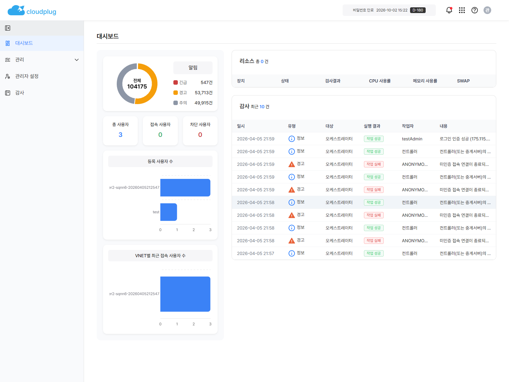

### 5.2 관리

이 영역은 실제 운영 업무가 가장 많이 일어나는 메뉴다.

- 컨트롤러 관리: 그룹 네트워크를 제어하는 컨트롤러 운영
- 중계서버 관리: 연결 중계 장비 운영
- 가상보안네트워크 관리: VNET 생성, 수정, 삭제와 토폴로지 확인
- 사용자 관리: 그룹 소속 사용자 등록과 권한 속성 관리
- 부서 관리: 부서 구조와 직위 관리
- 알람 관리: 알람 이력과 상태 확인
- 이상감지 관리: 이상감지 결과 확인
- 요청 관리: 승인, 반려 처리

### 5.3 관리자 설정

목적

- 그룹 관리자 본인 정보 수정
- 비밀번호 변경
- 그룹 데이터 동기화 수행

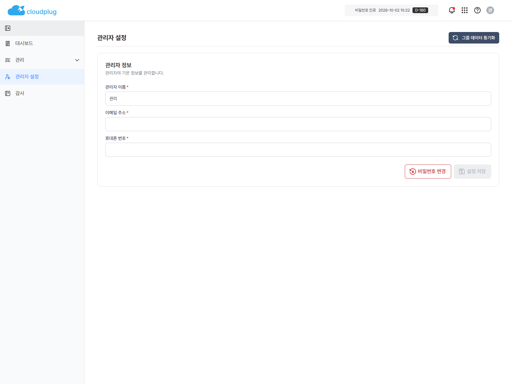

### 5.4 감사

목적

- 그룹 범위 변경 이력 확인
- 필요 시 백업 파일 다운로드

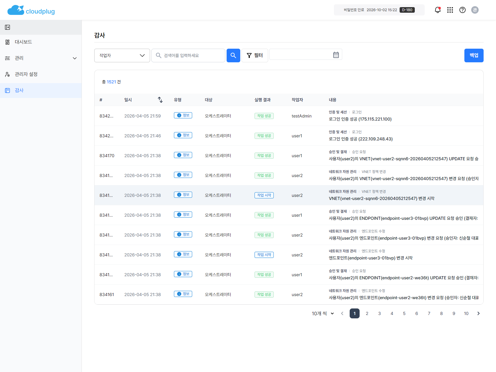

---

## 6. 컨트롤러 관리

### 6.1 진입 경로

- `관리 > 컨트롤러 관리`

### 6.2 화면에서 할 수 있는 작업

- 컨트롤러 목록 조회
- 검색과 필터
- 컨트롤러 등록
- 컨트롤러 수정
- 컨트롤러 삭제

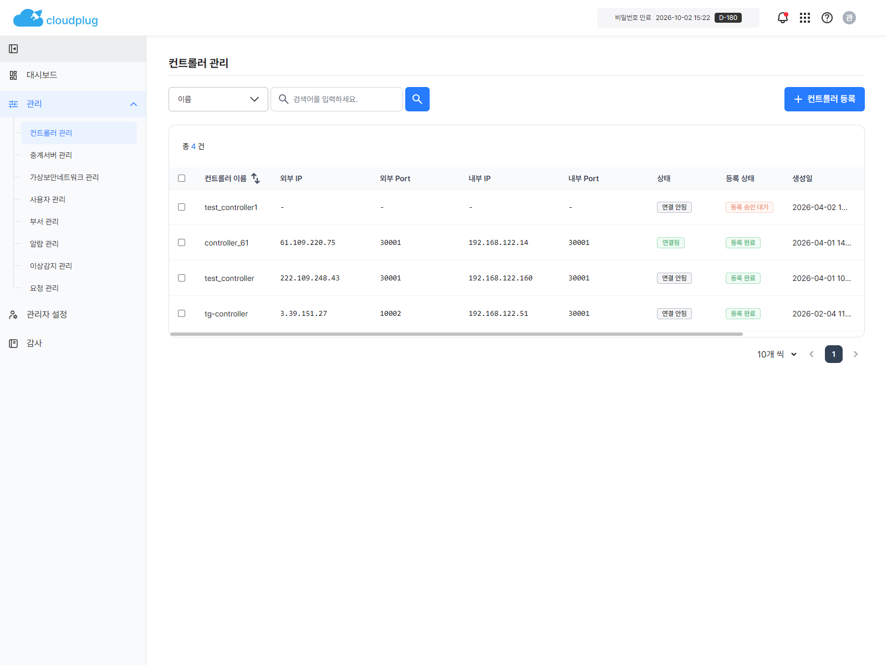

### 6.3 등록 절차

1. 우측 상단 `등록` 버튼을 클릭한다.
2. `컨트롤러 등록` 팝업이 열린다.
3. 이름과 설명을 입력한다.
4. `등록하기` 버튼을 클릭한다.

입력 항목 의미

- 컨트롤러 이름: 운영 화면과 다른 자원 선택 화면에 표시되는 식별 이름
- 설명: 용도, 설치 위치, 운영 메모

저장 후 확인

- 목록에 새 컨트롤러가 표시되는지 확인한다.
- 이름 중복이나 형식 오류가 없는지 확인한다.

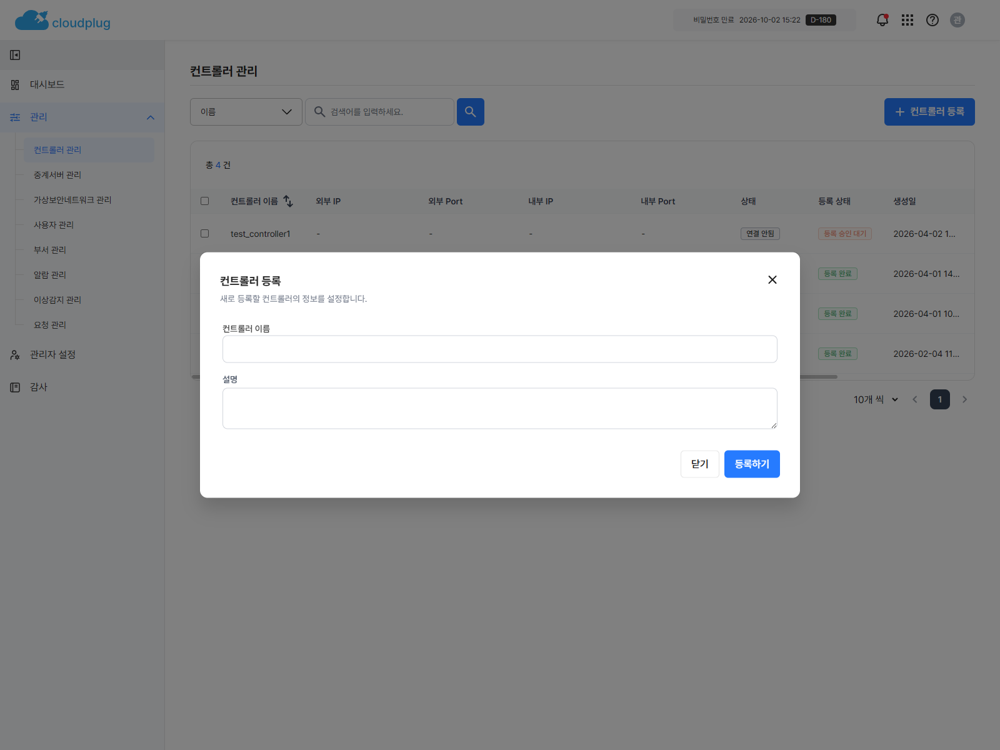

### 6.4 수정 절차

1. 목록에서 수정할 컨트롤러 행의 `수정` 버튼을 클릭한다.
2. 등록 팝업과 같은 형식의 수정 화면이 열린다.
3. 이름, 설명 등 변경할 항목을 수정한다.
4. 저장 후 목록에서 변경 내용이 반영됐는지 확인한다.

수정 시 확인할 항목

- 컨트롤러 이름 변경 여부
- 설명 변경 여부
- 연결 상태와 등록 상태가 의도치 않게 변하지 않았는지 확인

### 6.5 삭제 절차

1. 목록에서 삭제할 컨트롤러 행의 `삭제` 버튼을 클릭한다.
2. `컨트롤러 삭제 확인` 팝업에서 삭제 대상을 다시 확인한다.
3. `삭제` 버튼을 눌러 삭제를 확정한다.
4. 목록에서 해당 컨트롤러가 제거됐는지 확인한다.

주의사항

- 컨트롤러를 사용 중인 VNET이 있으면 삭제 전 영향 범위를 먼저 확인한다.
- 다중 선택 삭제도 가능하므로 선택 건수를 꼭 확인한다.

---

## 7. 중계서버 관리

### 7.1 진입 경로

- `관리 > 중계서버 관리`

### 7.2 화면에서 할 수 있는 작업

- 중계서버 목록 조회
- 등록, 수정, 삭제
- 검색과 상태 확인

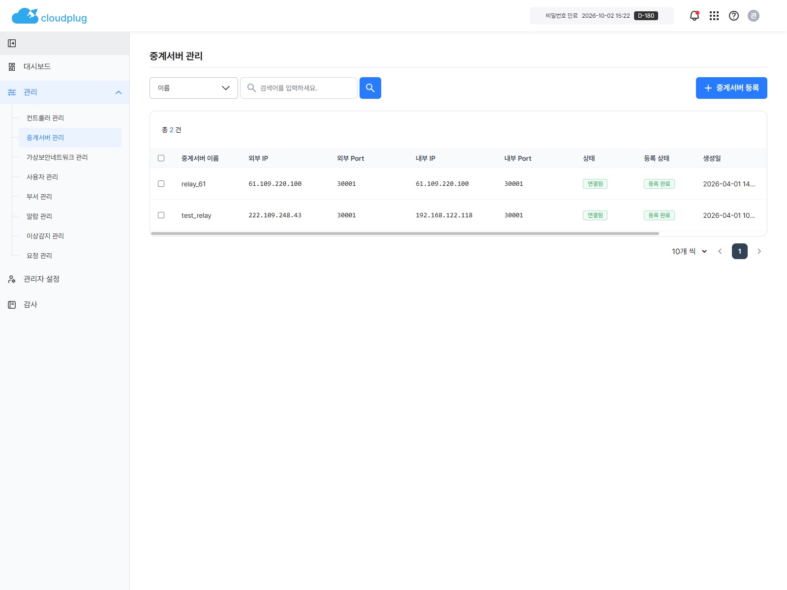

### 7.3 등록 절차

1. `등록` 버튼을 클릭한다.
2. `중계서버 등록` 팝업에서 이름과 설명을 입력한다.
3. `등록하기`를 클릭한다.

입력 항목 의미

- 중계서버 이름: 운영 화면에서 중계서버를 구분하는 이름
- 설명: 연결 목적, 설치 위치, 운영 메모

저장 후 확인

- 새 중계서버가 목록에 추가됐는지 확인한다.
- 이후 VNET 생성 화면의 중계서버 선택 목록에 보이는지 확인한다.

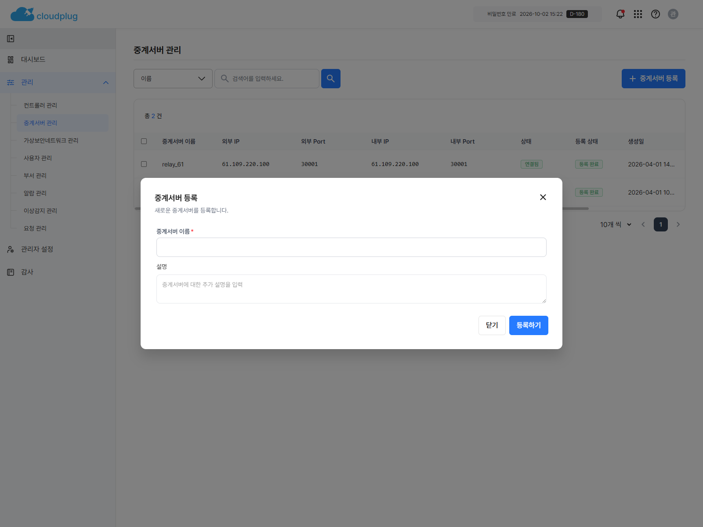

### 7.4 수정 절차

1. 목록에서 수정할 중계서버 행의 `수정` 버튼을 클릭한다.
2. 중계서버 수정 팝업에서 이름과 설명을 수정한다.
3. 저장 후 목록 반영 여부를 확인한다.

### 7.5 삭제 절차

1. 목록에서 삭제할 중계서버 행의 `삭제` 버튼을 클릭한다.
2. `중계서버 삭제 확인` 팝업에서 삭제 대상을 다시 확인한다.
3. `삭제` 버튼을 눌러 삭제를 확정한다.
4. 목록에서 제거 여부를 확인한다.

주의사항

- 중계서버를 참조 중인 VNET이 있는 경우 삭제 전 영향 범위를 확인한다.

---

## 8. 가상보안네트워크 관리

### 8.1 진입 경로

- `관리 > 가상보안네트워크 관리`

### 8.2 화면에서 할 수 있는 작업

- VNET 목록 조회
- VNET 생성, 수정, 삭제
- 엔드포인트 생성과 수정
- 토폴로지 확인
- 단말 접속 허용, 외부 트래픽 허용 상태 확인

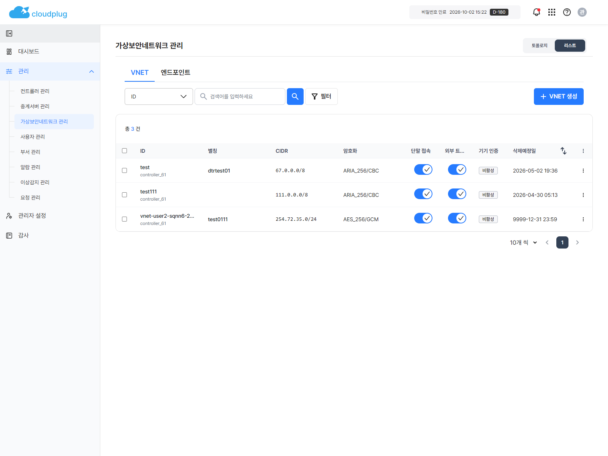

### 8.3 VNET 생성 절차

1. `생성` 버튼을 클릭한다.
2. `VNET 생성` 팝업에서 기본 정보를 입력한다.
3. 컨트롤러와 필요 시 중계서버를 선택한다.
4. 암호화 알고리즘과 모드를 선택한다.
5. IP 대역과 길이를 설정한다.
6. 보안 옵션을 설정한다.
7. `생성하기`를 클릭한다.

입력 항목 의미

- ID: VNET 고유 식별자
- 별칭: 운영자가 읽기 쉬운 표시 이름
- 컨트롤러: 해당 VNET을 제어할 컨트롤러
- 중계서버: 필요한 경우 경유할 중계서버
- 알고리즘 / 모드: 네트워크 암호화 방식
- IP 대역: 네트워크 주소 범위
- IP 대역 길이: 서브넷 크기
- 삭제 날짜: 자동 정리 기준일
- 단말 접속 허용: 장치 접속 허용 여부
- 외부 트래픽 허용: 외부 통신 허용 여부
- 기기 인증 여부: 장치 인증 사용 여부

운영 팁

- IP 대역은 기존 VNET과 겹치면 생성되지 않는다.
- 별칭은 사용자와 운영자 모두가 이해할 수 있는 이름으로 작성하는 것이 좋다.

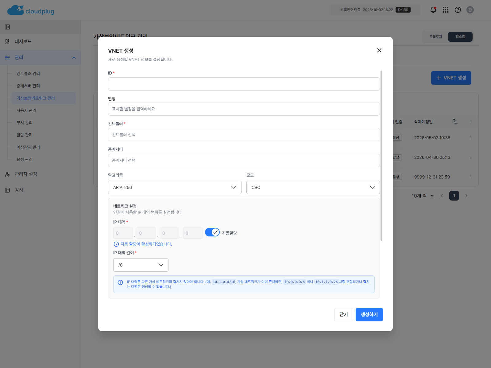

### 8.4 수정 절차

1. 목록에서 수정할 VNET 행의 `수정` 버튼을 클릭한다.
2. VNET 생성과 동일한 팝업이 수정 모드로 열린다.
3. 별칭, 연결 장비, 보안 옵션을 수정한다.
4. 저장 후 목록에 변경된 값이 반영됐는지 확인한다.

수정 시 확인할 항목

- 별칭
- 단말 접속 허용
- 외부 트래픽 허용
- 기기 인증 여부
- 삭제 예정일

### 8.5 삭제 절차

1. 목록에서 삭제할 VNET 행의 `삭제` 버튼을 클릭한다.
2. `VNET 삭제 확인` 팝업에서 삭제 대상을 확인한다.
3. `삭제` 버튼을 눌러 확정한다.
4. 목록에서 제거 여부를 확인한다.

주의사항

- VNET 삭제 시 연결된 엔드포인트와 사용자 할당 관계에 영향이 있을 수 있다.
- 다중 선택 삭제 시 선택 건수를 먼저 확인한다.

### 8.6 엔드포인트 생성 절차

1. VNET 상세 또는 엔드포인트 관리 화면에서 `생성` 버튼을 클릭한다.
2. `엔드포인트 생성` 팝업에서 VNET과 엔드포인트 정보를 입력한다.
3. 네트워크 주소, CIDR 길이, 인터페이스 정보를 입력한다.
4. 필요 시 MAC 주소와 UUID를 입력한다.
5. 단말 접속 허용, 외부 트래픽 허용 옵션을 설정한다.
6. 저장한다.

입력 항목 의미

- VNET: 엔드포인트가 속할 네트워크
- 엔드포인트 ID: 장치 식별자
- 엔드포인트 별칭: 읽기 쉬운 표시 이름
- 역할: 장치 역할
- 네트워크 주소: 엔드포인트에 할당할 주소
- 네트워크 인터페이스: 실제 장치 인터페이스명
- MAC 주소: 장치 식별용 MAC
- UUID: 장치 고유 식별자

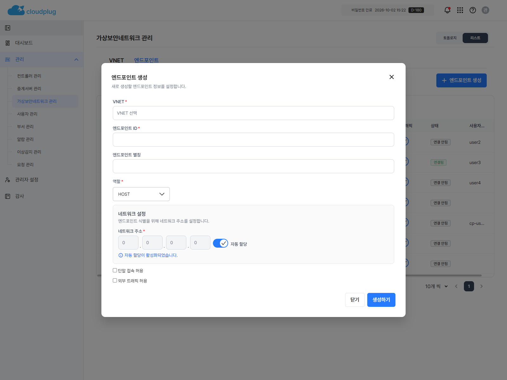

### 8.7 엔드포인트 수정 절차

1. 엔드포인트 목록에서 수정할 항목의 `수정` 버튼을 클릭한다.
2. 엔드포인트 생성 팝업과 같은 형식의 수정 화면이 열린다.
3. 별칭, 역할, 주소, 인터페이스, MAC 주소 등을 수정한다.
4. 저장 후 목록에 반영됐는지 확인한다.

### 8.8 엔드포인트 삭제 절차

1. 엔드포인트 목록에서 삭제할 항목의 `삭제` 버튼을 클릭한다.
2. `엔드포인트 삭제 확인` 팝업에서 삭제 대상을 확인한다.
3. `삭제` 버튼을 눌러 확정한다.
4. 목록에서 제거 여부를 확인한다.

### 8.9 엔드포인트 사용자 할당 절차

1. 엔드포인트 목록에서 사용자가 없는 항목의 `사용자 할당` 버튼을 클릭한다.
2. `사용자 선택` 팝업에서 ID, 이름, 휴대폰번호, 이메일로 사용자를 검색한다.
3. 할당할 사용자를 선택한다.
4. 저장 후 목록의 `사용자할당` 열에 사용자가 표시되는지 확인한다.

작업 위치

- 엔드포인트 행 우측 끝 `더보기` 메뉴에서 `사용자 할당`을 선택한다.

주의사항

- 이미 사용자가 할당된 엔드포인트에는 새 할당을 바로 할 수 없다.
- 진행 중인 관련 결재가 있으면 할당이 제한될 수 있다.

### 8.10 엔드포인트 사용자 할당 해제 절차

1. 엔드포인트 목록에서 사용자 할당이 된 항목의 `할당 해제` 버튼을 클릭한다.
2. `사용자 할당 해제 확인` 팝업에서 해제 여부를 다시 확인한다.
3. `해제` 버튼을 눌러 확정한다.
4. 목록에서 `사용자할당` 열이 비어 있는지 확인한다.

### 8.11 상세 화면에서 확인할 것

- 컨트롤러 연결 대상
- 네트워크 대역과 암호화 방식
- 장치별 온라인/오프라인 상태
- 할당 사용자와 역할
- 접속 허용과 외부 트래픽 허용 상태

---

## 9. 사용자 관리

### 9.1 진입 경로

- `관리 > 사용자 관리`

### 9.2 화면에서 할 수 있는 작업

- 사용자 조회
- 사용자 등록
- 사용자 수정
- 승인권자, 부서장 속성 관리
- 부서와 직위 연결

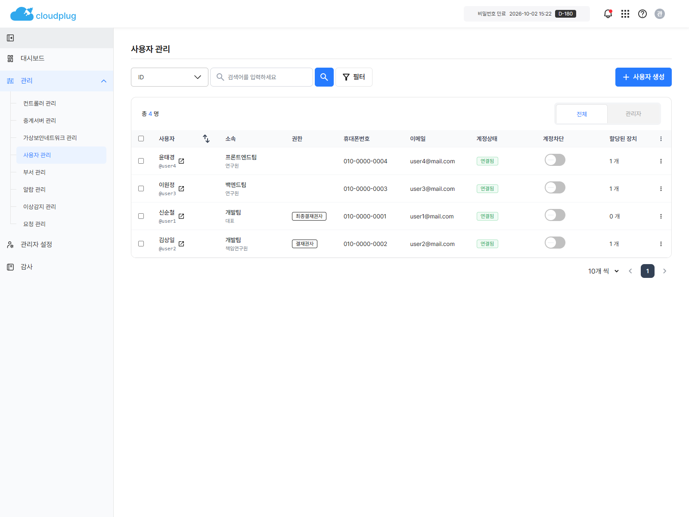

### 9.3 사용자 등록 절차

1. `등록` 버튼을 클릭한다.
2. `사용자 생성` 팝업에서 필수 항목을 입력한다.
3. 부서를 선택한다.
4. 필요 시 직위, 승인권자, 부서장 여부를 지정한다.
5. 저장한다.

입력 항목 의미

- 아이디: 로그인 계정 ID
- 이름: 사용자 실명 또는 표시명
- 이메일: 알림과 계정 식별용 주소
- 휴대폰번호: 연락처
- 부서: 소속 부서
- 직위: 조직 내 직위
- 승인권자: 요청 승인 가능 여부
- 부서장: 부서 관리자 여부

저장 후 확인

- 목록에서 사용자 검색이 되는지 확인한다.
- 요청 승인 대상이어야 하는 사용자라면 승인권자 속성이 반영됐는지 확인한다.

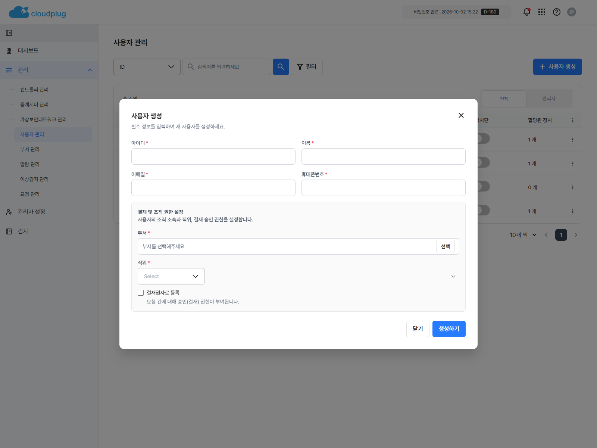

### 9.4 수정 절차

1. 사용자 목록에서 수정할 사용자 행의 `수정` 버튼을 클릭한다.
2. 사용자 생성 팝업과 같은 형식의 수정 화면이 열린다.
3. 이름, 이메일, 휴대폰번호, 부서, 직위, 승인권한을 수정한다.
4. 저장 후 목록과 상세 패널에서 반영 여부를 확인한다.

### 9.5 삭제 절차

1. 사용자 목록에서 삭제할 사용자 행의 `삭제` 버튼을 클릭한다.
2. `사용자 삭제 확인` 팝업에서 삭제 대상을 확인한다.
3. `삭제` 버튼을 눌러 확정한다.
4. 목록에서 제거 여부를 확인한다.

작업 위치

- 사용자 행 우측 끝 `더보기` 메뉴에서 `삭제`를 선택한다.

### 9.6 계정 차단 및 해제

1. 사용자 목록의 `계정차단` 토글을 확인한다.
2. 차단할 경우 토글을 켠다.
3. 해제할 경우 토글을 끈다.
4. 완료 메시지와 상태 반영 여부를 확인한다.

운영 팁

- 장기 미사용 계정이나 이상 행위 의심 계정은 먼저 차단 후 검토하는 것이 안전하다.

### 9.7 사용자 상세에서 장치 할당

1. 사용자 이름을 클릭해 상세 패널을 연다.
2. `장치 할당` 기능을 실행한다.
3. 미할당 엔드포인트를 검색해 선택한다.
4. 저장 후 사용자 상세의 장치 목록에 반영됐는지 확인한다.

### 9.8 사용자 상세에서 장치 할당 해제

1. 사용자 상세 패널에서 장치 목록을 확인한다.
2. 해제할 장치에서 `할당 해제`를 선택한다.
3. 확인 팝업에서 해제를 확정한다.
4. 장치 목록에서 제거 여부를 확인한다.

---

## 10. 부서 관리

### 10.1 진입 경로

- `관리 > 부서 관리`

### 10.2 화면에서 할 수 있는 작업

- 부서 구조 확인
- 부서 등록, 수정, 삭제
- 직위 등록

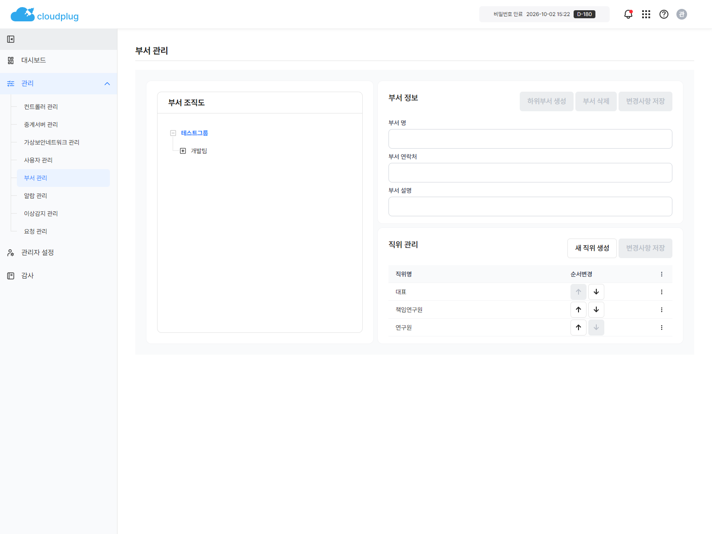

### 10.3 직위 등록 절차

1. 부서 관리 화면에서 `직위 등록` 버튼을 클릭한다.
2. `직위 생성` 팝업에 직위명을 입력한다.
3. 저장한다.

입력 항목 의미

- 직위명: 사용자 관리에서 선택할 직위 이름

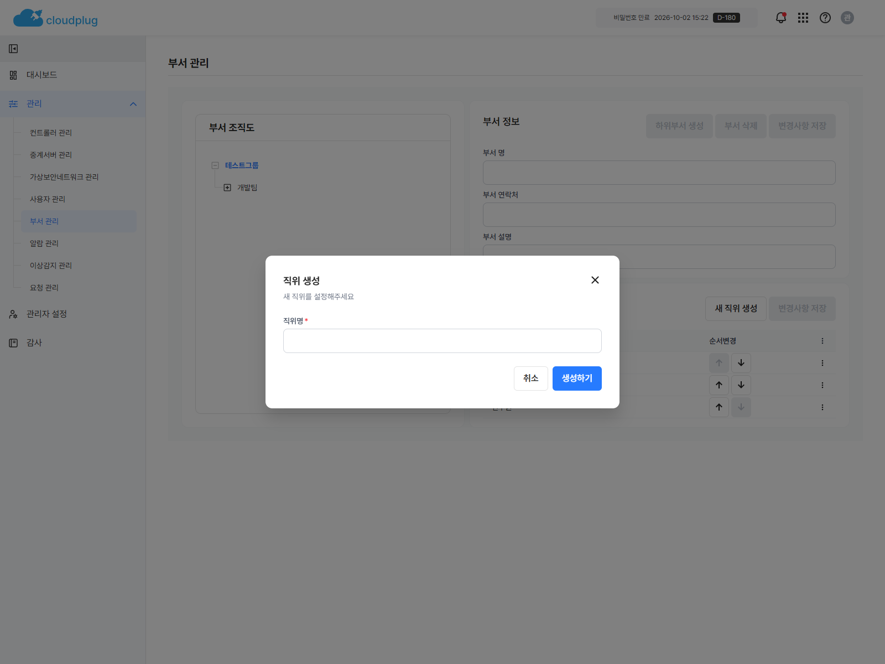

### 10.4 부서 생성 절차

1. 부서 트리에서 상위 부서를 선택한다.
2. `하위부서 생성` 버튼을 클릭한다.
3. 부서명, 번호, 설명을 입력한다.
4. 저장 후 트리에 새 부서가 보이는지 확인한다.

### 10.5 부서 수정 절차

1. 부서 트리에서 수정할 부서를 선택한다.
2. 우측 폼에서 이름, 번호, 설명을 수정한다.
3. `변경사항 적용` 또는 저장 버튼을 클릭한다.
4. 트리와 상세 폼에 변경 내용이 반영됐는지 확인한다.

### 10.6 부서 삭제 절차

1. 부서 트리에서 삭제할 부서를 선택한다.
2. `부서 삭제` 버튼을 클릭한다.
3. 확인 팝업에서 삭제를 확정한다.
4. 트리에서 해당 부서가 제거됐는지 확인한다.

주의사항

- 그룹 노드 자체는 삭제할 수 없다.
- 하위 부서나 연결된 사용자가 있는 경우 삭제 전 영향 범위를 검토한다.

### 10.7 직위 수정 절차

1. 직위 관리 표에서 수정할 직위의 편집 버튼을 클릭한다.
2. 직위명을 수정한다.
3. 저장 버튼을 눌러 변경을 확정한다.
4. 필요 시 순서 변경 버튼으로 표시 순서를 조정한다.
5. `변경사항 저장` 버튼으로 최종 반영한다.

### 10.8 직위 삭제 절차

1. 직위 관리 표에서 삭제할 직위의 `삭제` 버튼을 클릭한다.
2. `직위 삭제` 팝업에서 삭제 여부를 확인한다.
3. `삭제`를 눌러 확정한다.
4. 직위 목록에서 제거 여부를 확인한다.

---

## 11. 알람 관리와 이상감지 관리

### 11.1 알람 관리

진입 경로

- `관리 > 알람 관리`

할 수 있는 일

- 발생한 알람 목록 확인
- 상태와 발생 시점 확인
- 대응이 필요한 자원 식별

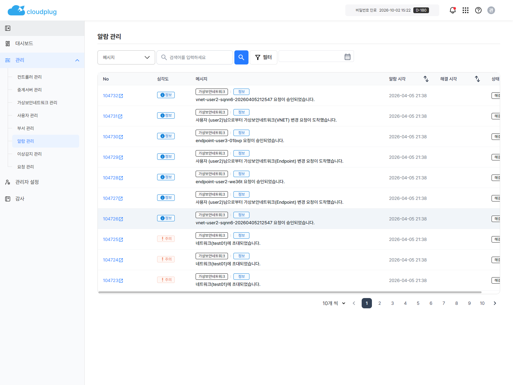

### 11.2 이상감지 관리

진입 경로

- `관리 > 이상감지 관리`

할 수 있는 일

- 이상 징후 발생 내역 확인
- 자원별 상태 추이 확인
- 추가 점검이 필요한 장비 식별

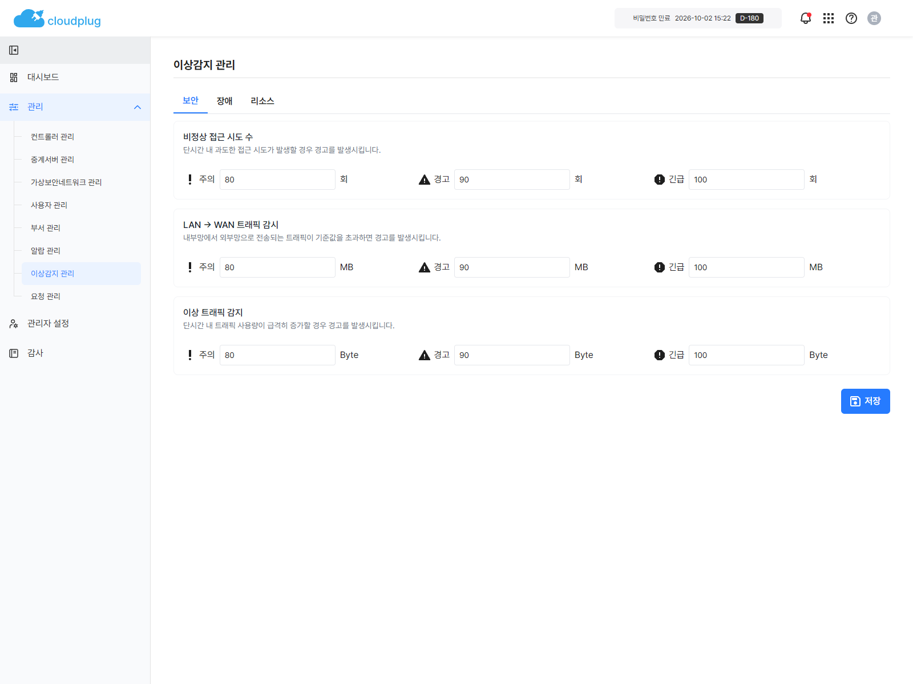

운영 팁

- 알람과 이상감지는 단독으로 보지 말고 대시보드와 함께 확인한다.
- 반복 발생하는 항목은 사용자, 컨트롤러, 엔드포인트 상태를 같이 본다.

---

## 12. 요청 관리

### 12.1 진입 경로

- `관리 > 요청 관리`

### 12.2 화면에서 할 수 있는 작업

- 요청 목록 조회
- 대기, 승인, 반려 상태 필터링
- 요청 승인
- 요청 반려

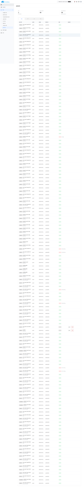

### 12.3 요청 처리 절차

1. 상태 필터에서 `대기`를 선택한다.
2. 요청 대상과 요청 유형을 확인한다.
3. 승인 가능한 건이면 `승인`을 클릭한다.
4. 반려해야 할 경우 `반려`를 클릭하고 사유를 입력한다.
5. 처리 후 상태가 변경됐는지 확인한다.

처리 시 판단 기준

- 요청 대상이 자기 그룹 범위인지 확인한다.
- 사용자와 장치, 네트워크 관계가 맞는지 확인한다.
- 반려할 경우 재요청이 가능하도록 사유를 구체적으로 작성한다.

### 12.4 승인 절차

1. 처리할 요청 행에서 `승인` 버튼을 클릭한다.
2. `결재 승인` 확인 팝업에서 승인 여부를 다시 확인한다.
3. `승인` 버튼을 눌러 처리한다.
4. 요청 결과가 `승인`으로 바뀌었는지 확인한다.

### 12.5 반려 절차

1. 처리할 요청 행에서 `거절` 버튼을 클릭한다.
2. 반려 사유 입력 팝업에서 사유를 작성한다.
3. `반려`를 눌러 처리한다.
4. 요청 결과와 반려 사유가 목록에 반영됐는지 확인한다.

입력 가이드

- 사유 템플릿: 자주 사용하는 반려 사유를 빠르게 선택
- 상세 사유: 재요청자가 수정 방향을 이해할 수 있도록 구체적으로 작성

---

## 13. 관리자 설정

### 13.1 진입 경로

- `관리자 설정`

### 13.2 화면에서 할 수 있는 작업

- 관리자 이름, 이메일, 연락처 수정
- 비밀번호 변경
- 그룹 데이터 동기화

### 13.3 프로필 수정 절차

1. 이름, 이메일, 연락처를 수정한다.
2. `저장` 버튼을 클릭한다.
3. 비밀번호 확인 팝업이 열리면 현재 비밀번호를 입력한다.
4. 저장 완료 메시지를 확인한다.

### 13.4 비밀번호 변경 절차

1. `비밀번호 변경` 버튼을 클릭한다.
2. 현재 비밀번호, 새 비밀번호, 새 비밀번호 확인을 입력한다.
3. `변경` 버튼을 클릭한다.
4. 성공 메시지 후 재로그인 요구 여부를 확인한다.

비밀번호 입력 기준

- 영문, 숫자, 특수문자를 포함한 8~16자
- 새 비밀번호와 확인 값이 동일해야 함

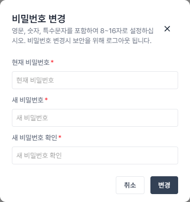

### 13.5 그룹 데이터 동기화

1. `그룹 데이터 동기화` 버튼을 클릭한다.
2. 확인 팝업에서 동기화를 다시 확인한다.
3. 완료 메시지를 확인한다.

동기화가 필요한 경우

- 사용자, 부서, 직위 변경 후 반영 확인이 필요할 때
- 그룹 범위 자원 정보가 최신 상태인지 확인해야 할 때

---

## 14. 감사

### 14.1 진입 경로

- `감사`

### 14.2 화면에서 할 수 있는 작업

- 작업 이력 조회
- 조건 검색
- 기간별 백업 파일 다운로드

### 14.3 백업 다운로드 절차

1. `백업` 버튼을 클릭한다.
2. 백업 대상 날짜를 선택한다.
3. 다운로드를 실행한다.

입력 항목 의미

- 백업 날짜: 다운로드할 감사 데이터 기준일

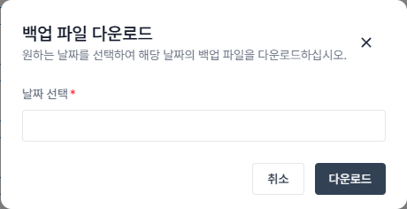

---

## 15. 그룹 관리자 운영 체크리스트

매일 확인

- 대시보드 경고와 요청 대기 건수
- 주요 VNET과 엔드포인트 상태
- 신규 사용자 반영 여부
- 이상감지와 알람 발생 여부

변경 작업 전 확인

- 변경 대상이 자기 그룹 범위인지 확인
- 이미 같은 이름 또는 같은 대역이 존재하는지 확인
- 요청 승인 대상인지 확인

변경 작업 후 확인

- 목록에 반영됐는지 확인
- 요청 상태가 변경됐는지 확인
- 사용자와 네트워크 연결이 정상인지 확인
- 감사 이력이 남았는지 확인

---

## 16. 자주 묻는 상황과 대응

### 16.1 메뉴가 보이지 않는 경우

- 최고 관리자 전용 메뉴일 수 있다.
- 그룹 관리자는 `라이선스`, `보안 및 정책`, `시스템품질`, `조직 관리` 메뉴를 사용하지 않는다.

### 16.2 등록 버튼이 비활성화되거나 저장이 되지 않는 경우

- 필수 입력값 누락 여부를 확인한다.
- 중복된 이름이나 잘못된 형식이 없는지 확인한다.
- 사용자나 자원이 다른 그룹에 속해 있지 않은지 확인한다.

### 16.3 요청 처리가 되지 않는 경우

- 이미 다른 승인자가 처리했는지 확인한다.
- 반려 사유가 필요한지 확인한다.
- 요청 대상 자원이 현재 그룹 범위인지 확인한다.

### 16.4 네트워크 생성 후 연결이 기대와 다를 때

- 컨트롤러와 중계서버 선택이 맞는지 확인한다.
- IP 대역이 기존 네트워크와 겹치지 않는지 확인한다.
- 엔드포인트 주소와 역할이 올바른지 확인한다.

---

## 17. 빠른 진입 경로

- 대시보드: `대시보드`
- 컨트롤러 관리: `관리 > 컨트롤러 관리`
- 중계서버 관리: `관리 > 중계서버 관리`
- VNET 관리: `관리 > 가상보안네트워크 관리`
- 사용자 관리: `관리 > 사용자 관리`
- 부서 관리: `관리 > 부서 관리`
- 요청 관리: `관리 > 요청 관리`
- 관리자 설정: `관리자 설정`
- 감사: `감사`
